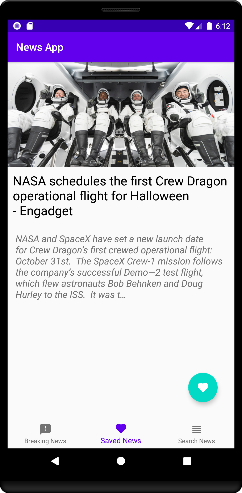
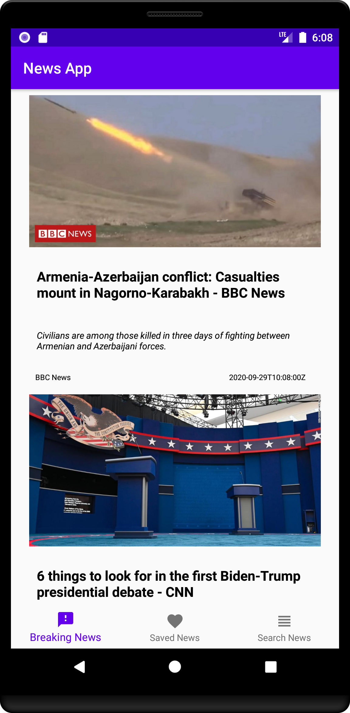
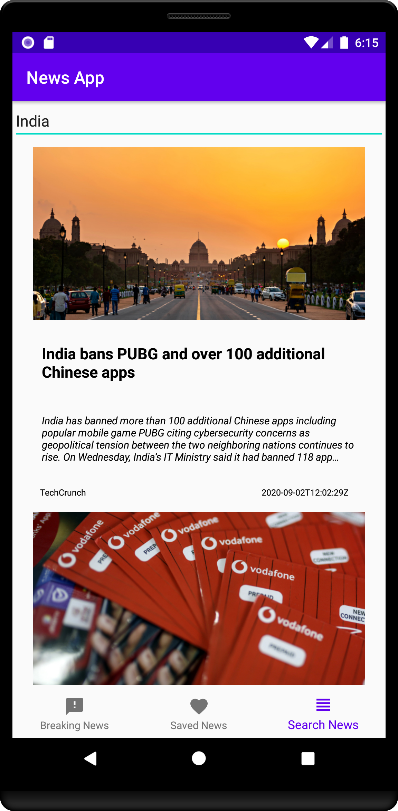

# News App

This is a News App developed using Kotlin and XML. The app fetches news articles from a news API, displays them in a user-friendly interface, and includes a search functionality to find specific news articles.

---

## Features

- **Fetch Latest News**: Retrieves news articles from a reliable API.
- **Search News**: Search for articles by keywords.
- **User-Friendly Interface**: Designed using XML for a clean and intuitive UI.
- **Kotlin-Based**: Fully written in Kotlin for robust and modern development.

---

## Prerequisites

Before running the app, ensure you have the following:

- Android Studio installed on your system.
- A valid API key from the news API provider.
- Minimum SDK version: 21 (Android 5.0, Lollipop).
- Internet access for fetching news articles.

---

## API Details

The app uses a third-party news API to fetch the latest news articles.

1. **API Endpoint**: Replace `{API_KEY}` with your actual API key.

   ```plaintext
   https://newsapi.org/v2/everything?q={query}&apiKey={API_KEY}
   ```

2. **Required Parameters**:

   - `q`: Search keyword (string).
   - `apiKey`: Your API key (string).

3. **Response**:
   The API returns a JSON response with fields such as `title`, `description`, `urlToImage`, and `publishedAt`.

---

## ER Diagram

Below is the Entity-Relationship (ER) diagram representing the News App:

### Diagram Representation

- **Entities**:
  - **Users**: Represents the app users.
  - **News Articles**: Represents the fetched news articles.
  - **API**: Represents the news API used to fetch articles.

- **Relationships**:
  - **Users** can search for and read **News Articles**.
  - **News Articles** are fetched from the **API**.

```
[Users] --- Searches ---> [News Articles]
[Users] --- Reads ---> [News Articles]
[API] --- Fetches ---> [News Articles]
```
### ScreenShots
<p align="center">
  <br>
  
  
  
</p>

### How It Works
1. **User Interaction**: Users interact with the app through a search bar and list of news articles.
2. **API Request**: When a search query is entered, the app sends a request to the News API.
3. **Data Fetching**: The API fetches relevant articles based on the query.
4. **Display Articles**: The fetched news articles are displayed in a recycler view for users to read.
5. **Continuous Interaction**: Users can perform multiple searches and view details of articles.

---

## Installation

1. Clone the repository:

   ```bash
   git clone https://github.com/your-username/news-app.git
   ```

2. Open the project in Android Studio.

3. Add your API key in `Constants.kt`:

   ```kotlin
   object Constants {
       const val BASE_URL = "https://newsapi.org/v2/"
       const val API_KEY = "your_api_key_here"
   }
   ```

4. Build and run the app on an emulator or physical device.

---

## Code Overview

### XML Layout (Snippet)

```xml
<EditText
    android:id="@+id/searchEditText"
    android:layout_width="match_parent"
    android:layout_height="wrap_content"
    android:hint="Search news..." />

<Button
    android:id="@+id/searchButton"
    android:layout_width="wrap_content"
    android:layout_height="wrap_content"
    android:text="Search" />
```

### Kotlin Code (Snippet)

#### Fetching News

```kotlin
private fun fetchNews(query: String) {
    val newsApi = NewsService.create().getNews(query, Constants.API_KEY)

    newsApi.enqueue(object : Callback<NewsResponse> {
        override fun onResponse(call: Call<NewsResponse>, response: Response<NewsResponse>) {
            if (response.isSuccessful) {
                val newsList = response.body()?.articles ?: emptyList()
                newsRecyclerView.adapter = NewsAdapter(newsList)
            }
        }

        override fun onFailure(call: Call<NewsResponse>, t: Throwable) {
            // Handle failure
        }
    })
}
```

#### Retrofit Service

```kotlin
interface NewsApi {
    @GET("everything")
    fun getNews(@Query("q") query: String, @Query("apiKey") apiKey: String): Call<NewsResponse>
}
```

---

## License

This project is licensed under the MIT License. See the LICENSE file for details.

---

## Contributing

Contributions are welcome! Please open an issue or submit a pull request.

---


